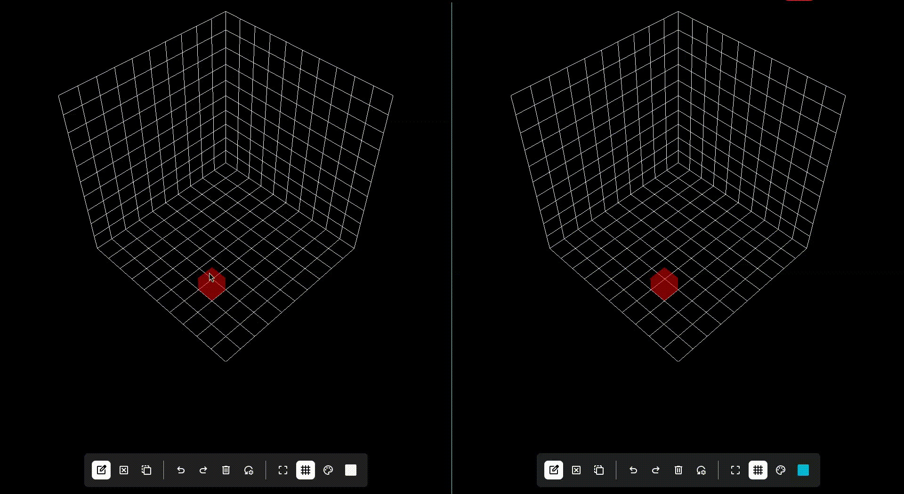

# Collab Voxel

A collaborative voxel editor based on WebGL built with Svelte, Three.js and Y.js.
It allows sharing the same scene between tabs of a browser using the BroadcastChannel API or remotely using a WebSocket server located in [bin](./bin/).
There is a demo using the BroadcastChannel API available [here](https://trzcin.github.io/collab-voxel/).

## Demo



## How to use

- `Left click` - place voxel at mouse position
- `Middle click + move mouse` - pan the camera
- `Right click + move mouse` - rotate camera

At the bottom of the screen you'll see a toolbar with some buttons and settings.
All of them also have keyboard shortcuts for quicker access.
Starting from the left:

- Placing mode - changes how you modify voxels
    - Attach `a` - add new voxel next to the selected one or next to the edge of the scene
    - Delete `d` - delete selected voxel
    - Replace `r` - replace the selected voxel (with a different color)
- Undo `Ctrl + z`
- Redo `Ctrl + y`
- Clear scene `c` - remove all voxels
- Reset view `R` - resets the camera to the initial position
- Toggle wireframe `w` - shows a wireframe instead of the standard voxel mesh
- Toggle grid `g` - toggles the grid lines on the edges of the scene
- Toggle palette `p`
    - toggles the color palette sidebar
    - click one of the predefined colors to select it
    - you can add new colors at the bottom of the sidebar by pressing the `+` button
    - your custom colors are persisted in the browser and can be removed by middle clicking
- Current color - shows the currently active color

## Collaboration

Every user that opens the app gets assigned a random color for their selection.
You can see the selections of all users.

## Development

Install dependencies and run the app with Vite:

```bash
npm i
npm run dev
```

## Collaboration mode

To make the app use the WebSocket server set the following environment variable:

```bash
VITE_LOCAL=false
VITE_WS_URL="ws://localhost:1234" # if you don't set this variable this is the default value that will be used
```

## Running the WebSocket server

Go into the [bin](./bin/) directory containing the server and run the following:

```bash
npm i
PORT=1234 npm run start # 1234 is the default port if one isn't explicitly set, you can customize it
```

## Building for production

Install dependencies then build the application:

```bash
npm i
npm run build
```

Run a preview of the built version:

```bash
npm run preview
```
